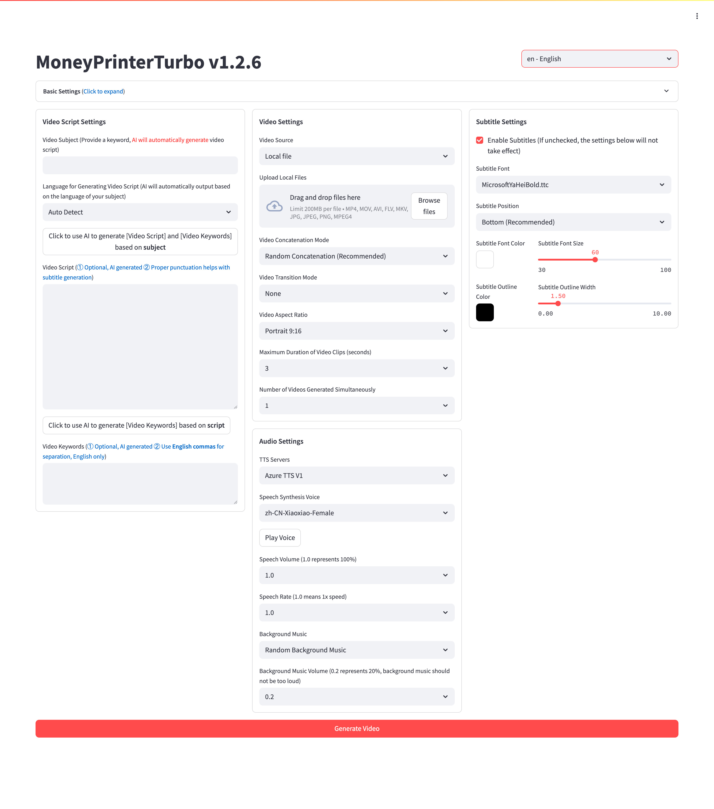
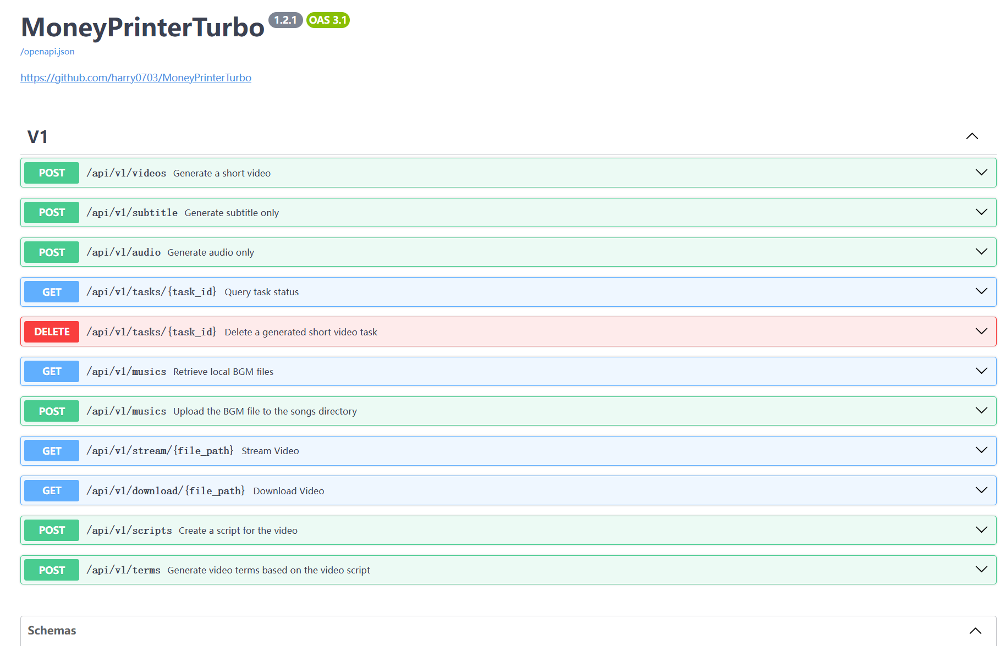
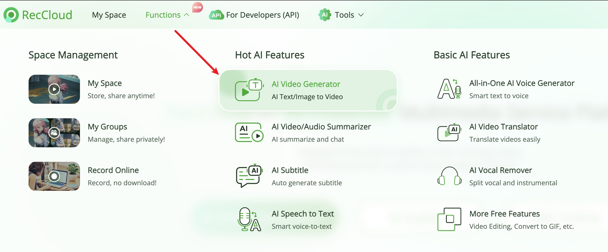
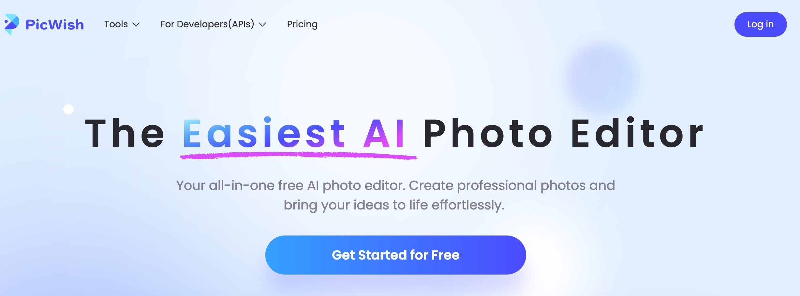

<div align="center">
<h1 align="center">Buat Uang 💸</h1>
<h3 align="center"><i>Generator Video Otomatis dengan AI</i></h3>
<p align="center"><i>Berbasis MoneyPrinterTurbo</i></p>

<p align="center">
  <a href="https://github.com/harry0703/MoneyPrinterTurbo/stargazers"></a>
  <a href="https://github.com/harry0703/MoneyPrinterTurbo/issues"></a>
  <a href="https://github.com/harry0703/MoneyPrinterTurbo/network/members"></a>
  <a href="https://github.com/harry0703/MoneyPrinterTurbo/blob/main/LICENSE"></a>
</p>

<h3>Bahasa Indonesia | <a href="README.md">简体中文</a> | <a href="README-en.md">English</a></h3>

<div align="center">
  <a href="https://trendshift.io/repositories/8731" target="_blank"></a>
</div>
<br>

**Buat Uang** adalah generator video otomatis berbasis AI yang memudahkan Anda membuat konten video berkualitas tinggi.

Cukup berikan sebuah <b>topik</b> atau <b>kata kunci</b>, sistem akan secara otomatis menghasilkan naskah video, materi video, subtitle video, dan musik latar belakang, kemudian menggabungkannya menjadi video pendek HD siap upload!

✂️ **Baru: Clipper.** Potong podcast/live jadi klip vertikal bersubtitle dari link YouTube atau file lokal. Lihat [PANDUAN-CLIPPER.md](PANDUAN-CLIPPER.md).

💸 **Bisa dipakai 100% gratis.** Baca [PANDUAN-GRATIS-DAN-KUALITAS.md](PANDUAN-GRATIS-DAN-KUALITAS.md) untuk pilihan tanpa kredit API, ekspektasi kualitas, dan tips monetisasi.

<h4>Antarmuka Web</h4>



<h4>Antarmuka API</h4>



</div>

## Ucapan Terima Kasih Khusus 🙏

Karena **deployment** dan **penggunaan** proyek ini memiliki hambatan tertentu bagi pengguna pemula, kami ingin menyampaikan terima kasih khusus kepada
**RecCloud (Platform Layanan Multimedia Bertenaga AI)** yang menyediakan layanan `AI Video Generator` gratis berdasarkan proyek ini. Anda dapat menggunakannya secara online tanpa deployment, sangat nyaman.

- Versi Mandarin: https://reccloud.cn
- Versi Inggris: https://reccloud.com



## Terima Kasih untuk Sponsor 🙏

Terima kasih kepada Picwish https://picwish.com atas dukungan dan sponsor untuk proyek ini, memungkinkan pembaruan dan pemeliharaan berkelanjutan.

Picwish berfokus pada **bidang pemrosesan gambar**, menyediakan berbagai **alat pemrosesan gambar** yang sangat menyederhanakan operasi kompleks, benar-benar membuat pemrosesan gambar lebih mudah.



## Fitur 🎯

- [x] **Arsitektur MVC** lengkap, kode **terstruktur jelas**, mudah dipelihara, mendukung `API` dan `Antarmuka Web`
- [x] Mendukung naskah video **dibuat otomatis oleh AI**, juga bisa **naskah kustom**
- [x] Mendukung berbagai ukuran **video berkualitas tinggi**
    - [x] Potret 9:16, `1080x1920`
    - [x] Lanskap 16:9, `1920x1080`
- [x] Mendukung **batch video generation**, dapat membuat beberapa video sekaligus, lalu pilih yang paling memuaskan
- [x] Mendukung pengaturan **durasi klip video**, memudahkan penyesuaian frekuensi pergantian materi
- [x] Mendukung naskah video dalam bahasa **Indonesia**, **Inggris**, **Mandarin**, dan **banyak bahasa lainnya**
- [x] Mendukung **sintesis berbagai suara**, dapat **pratinjau real-time** efeknya
- [x] Mendukung **pembuatan subtitle**, dapat menyesuaikan `font`, `posisi`, `warna`, `ukuran`, juga mendukung pengaturan `outline subtitle`
- [x] Mendukung **musik latar belakang**, acak atau file musik tertentu, dapat mengatur `volume musik latar`
- [x] Sumber materi video **berkualitas tinggi** dan **bebas royalti**, juga bisa menggunakan **materi lokal** sendiri
- [x] Mendukung integrasi berbagai model seperti **OpenAI**, **Moonshot**, **Azure**, **gpt4free**, **one-api**, **Qwen (通义千问)**, **Google Gemini**, **Ollama**, **DeepSeek**, **ERNIE (文心一言)**, **Pollinations**, dan banyak lagi
    - Pengguna Indonesia disarankan menggunakan **DeepSeek**, **OpenAI**, atau **Google Gemini** sebagai penyedia model (dapat diakses langsung, gratis atau murah)

## Rencana Masa Depan 📅

- [ ] Dukungan dubbing GPT-SoVITS
- [ ] Optimasi sintesis suara menggunakan model besar untuk output suara yang lebih alami dan kaya emosi
- [ ] Tambahkan efek transisi video untuk pengalaman menonton yang lebih lancar
- [ ] Tambahkan lebih banyak sumber materi video, tingkatkan kecocokan antara materi video dan naskah
- [ ] Tambahkan opsi durasi video: pendek, menengah, panjang
- [ ] Dukungan lebih banyak penyedia sintesis suara, seperti OpenAI TTS
- [ ] Otomatisasi upload ke platform YouTube

## Demo Video 📺

### Potret 9:16

<table>
<thead>
<tr>
<th align="center">▶️ Cara Menambah Kesenangan dalam Hidup</th>
<th align="center">▶️ Apa Arti Kehidupan</th>
</tr>
</thead>
<tbody>
<tr>
<td align="center"><video src="https://github.com/harry0703/MoneyPrinterTurbo/assets/4928832/a84d33d5-27a2-4aba-8fd0-9fb2bd91c6a6"></video></td>
<td align="center"><video src="https://github.com/harry0703/MoneyPrinterTurbo/assets/4928832/112c9564-d52b-4472-99ad-970b75f66476"></video></td>
</tr>
</tbody>
</table>

### Lanskap 16:9

<table>
<thead>
<tr>
<th align="center">▶️ Apa Arti Kehidupan</th>
<th align="center">▶️ Mengapa Harus Berolahraga</th>
</tr>
</thead>
<tbody>
<tr>
<td align="center"><video src="https://github.com/harry0703/MoneyPrinterTurbo/assets/4928832/346ebb15-c55f-47a9-a653-114f08bb8073"></video></td>
<td align="center"><video src="https://github.com/harry0703/MoneyPrinterTurbo/assets/4928832/271f2fae-8283-44a0-8aa0-0ed8f9a6fa87"></video></td>
</tr>
</tbody>
</table>

## Persyaratan Sistem 📦

- Disarankan minimal 4 core CPU atau lebih, memori 4G atau lebih, GPU tidak wajib
- Windows 10 atau MacOS 11.0, dan versi yang lebih baru

## Memulai Cepat 🚀

### Jalankan di Google Colab
Hindari konfigurasi environment lokal, klik untuk langsung mencoba MoneyPrinterTurbo di Google Colab

[](https://colab.research.google.com/github/harry0703/MoneyPrinterTurbo/blob/main/docs/MoneyPrinterTurbo.ipynb)

### Paket Startup Satu Klik Windows

Unduh paket startup satu klik, ekstrak dan langsung gunakan (path jangan ada **huruf Mandarin**, **karakter khusus**, **spasi**)

- Baidu Netdisk (v1.2.6): https://pan.baidu.com/s/1wg0UaIyXpO3SqIpaq790SQ?pwd=sbqx Kode: sbqx
- Google Drive (v1.2.6): https://drive.google.com/file/d/1HsbzfT7XunkrCrHw5ncUjFX8XX4zAuUh/view?usp=sharing

Setelah download, disarankan **double-click** `update.bat` terlebih dahulu untuk update ke **kode terbaru**, kemudian double-click `start.bat` untuk memulai

Setelah startup, browser akan terbuka otomatis (jika terbuka kosong, disarankan gunakan **Chrome** atau **Edge**)

## Instalasi & Deployment 📥

### Prasyarat

- Sebisa mungkin jangan gunakan **path dengan huruf Mandarin**, untuk menghindari masalah yang tidak terduga
- Pastikan **jaringan** Anda normal, VPN perlu membuka mode `global traffic`

#### ① Clone Kode

```shell
git clone https://github.com/harry0703/MoneyPrinterTurbo.git
```

#### ② Modifikasi File Konfigurasi (Opsional, disarankan konfigurasi di WebUI setelah startup)

- Salin file `config.example.toml` dan beri nama `config.toml`
- Sesuai instruksi dalam file `config.toml`, konfigurasikan `pexels_api_keys` dan `llm_provider`, dan sesuai dengan service provider llm_provider, konfigurasikan API Key terkait

### Deployment Docker 🐳

#### ① Jalankan Docker

Jika belum menginstal Docker, silakan instal terlebih dahulu https://www.docker.com/products/docker-desktop/

Jika menggunakan sistem Windows, silakan lihat dokumentasi Microsoft:

1. https://learn.microsoft.com/id-id/windows/wsl/install
2. https://learn.microsoft.com/id-id/windows/wsl/tutorials/wsl-containers

```shell
cd BuatUang
docker compose up
```

> Catatan: Docker versi lama memakai perintah `docker-compose up` (dengan tanda hubung).

#### ② Akses Antarmuka Web

Buka browser, kunjungi http://127.0.0.1:8501

#### ③ Akses Dokumentasi API

Buka browser, kunjungi http://127.0.0.1:8080/docs atau http://127.0.0.1:8080/redoc

> 🔒 Secara default port hanya bisa diakses dari komputer ini. Kalau ingin membukanya ke jaringan lain (misalnya di VPS), **isi `api_key` di `config.toml` dulu**, lalu hapus prefix `127.0.0.1:` di `docker-compose.yml`. Setiap request API kemudian wajib mengirim header `x-api-key`.

### Deployment Manual 📦

> Tutorial Video

- Demo penggunaan lengkap: https://v.douyin.com/iFhnwsKY/
- Cara deploy di Windows: https://v.douyin.com/iFyjoW3M

#### ① Buat Virtual Environment

Disarankan menggunakan [conda](https://conda.io/projects/conda/en/latest/user-guide/install/index.html) untuk membuat virtual environment python

```shell
git clone https://github.com/cupitebet/BuatUang.git
cd BuatUang
conda create -n BuatUang python=3.11
conda activate BuatUang
pip install -r requirements.txt
```

#### ② Tidak Perlu ImageMagick

Versi ini memakai moviepy 2.x yang merender subtitle dengan Pillow, jadi **ImageMagick tidak perlu diinstal**. Font subtitle bawaan (Noto Sans Bold) sudah ada di `resource/fonts/`.

Subtitle mode **whisper** bersifat opsional. Kalau mau memakainya, instal paket tambahan:

```shell
pip install -r requirements-whisper.txt
```

#### ③ Jalankan Antarmuka Web 🌐

Perhatikan untuk mengeksekusi perintah berikut di `direktori root` proyek MoneyPrinterTurbo

###### Windows

```bat
webui.bat
```

###### MacOS atau Linux

```shell
sh webui.sh
```

Setelah startup, browser akan terbuka otomatis (jika terbuka kosong, disarankan gunakan **Chrome** atau **Edge**)

#### ④ Jalankan Layanan API 🚀

```shell
python main.py
```

Setelah startup, Anda dapat melihat `dokumentasi API` di http://127.0.0.1:8080/docs atau http://127.0.0.1:8080/redoc untuk debugging interface langsung secara online, pengalaman cepat.

## Sintesis Suara 🗣

Daftar semua suara yang didukung dapat dilihat di: [Daftar Suara](./docs/voice-list.txt)

2024-04-16 v1.1.2 menambahkan 9 suara sintesis suara Azure, memerlukan konfigurasi API KEY, suara yang disintesis lebih realistis.

**Suara Bahasa Indonesia yang Tersedia:**
- `id-ID-ArdiNeural` - Pria
- `id-ID-GadisNeural` - Wanita

## Pembuatan Subtitle 📜

Saat ini mendukung 2 cara pembuatan subtitle:

- **edge**: `Kecepatan pembuatan cepat`, performa lebih baik, tidak ada persyaratan untuk konfigurasi komputer, tetapi kualitas mungkin tidak stabil
- **whisper**: `Kecepatan pembuatan lambat`, performa lebih buruk, ada persyaratan tertentu untuk konfigurasi komputer, tetapi `kualitas lebih andal`

Anda dapat mengubah `subtitle_provider` dalam file konfigurasi `config.toml` untuk beralih

Disarankan menggunakan mode `edge`, jika kualitas subtitle yang dihasilkan tidak baik, baru beralih ke mode `whisper`

> Catatan:

1. Mode whisper perlu mengunduh file model dari HuggingFace, sekitar 3GB, pastikan jaringan lancar
2. Jika dibiarkan kosong, berarti subtitle tidak akan dibuat.

> Karena HuggingFace tidak dapat diakses di Indonesia, jika kesulitan download, Anda dapat menggunakan metode berikut untuk mengunduh file model `whisper-large-v3`

Alamat download:

- Baidu Netdisk: https://pan.baidu.com/s/11h3Q6tsDtjQKTjUu3sc5cA?pwd=xjs9
- Quark Netdisk: https://pan.quark.cn/s/3ee3d991d64b

Setelah model diunduh, ekstrak, letakkan seluruh direktori di `.\MoneyPrinterTurbo\models`,
Path file akhir seharusnya seperti ini: `.\MoneyPrinterTurbo\models\whisper-large-v3`

```
MoneyPrinterTurbo
  ├─models
  │   └─whisper-large-v3
  │          config.json
  │          model.bin
  │          preprocessor_config.json
  │          tokenizer.json
  │          vocabulary.json
```

## Musik Latar Belakang 🎵

Musik latar belakang untuk video, terletak di direktori `resource/songs` proyek.
> Saat ini proyek berisi beberapa musik default dari video YouTube, jika ada pelanggaran hak cipta, silakan hapus.

## Font Subtitle 🅰

Digunakan untuk rendering subtitle video, terletak di direktori `resource/fonts` proyek, Anda juga bisa memasukkan font sendiri.

## Pertanyaan Umum 🤔

### ❓RuntimeError: No ffmpeg exe could be found

Biasanya, ffmpeg akan diunduh secara otomatis dan akan terdeteksi secara otomatis.
Tetapi jika environment Anda bermasalah dan tidak dapat mengunduh otomatis, Anda mungkin mengalami error berikut:

```
RuntimeError: No ffmpeg exe could be found.
Install ffmpeg on your system, or set the IMAGEIO_FFMPEG_EXE environment variable.
```

Dalam hal ini Anda dapat mengunduh ffmpeg dari https://www.gyan.dev/ffmpeg/builds/, ekstrak, atur `ffmpeg_path` ke path instalasi sebenarnya.

```toml
[app]
# Silakan atur sesuai path sebenarnya, perhatikan pemisah path Windows adalah \\
ffmpeg_path = "C:\\Users\\harry\\Downloads\\ffmpeg.exe"
```

### ❓OSError: [Errno 24] Too many open files

Masalah ini disebabkan oleh batasan jumlah file yang dibuka sistem, dapat diselesaikan dengan memodifikasi batasan jumlah file yang dibuka sistem.

Lihat batasan saat ini

```shell
ulimit -n
```

Jika terlalu rendah, dapat dinaikkan, misalnya

```shell
ulimit -n 10240
```

### ❓Download model Whisper gagal, muncul error berikut

LocalEntryNotfoundEror: Cannot find an appropriate cached snapshotfolderfor the specified revision on the local disk and
outgoing trafic has been disabled.
To enablerepo look-ups and downloads online, pass 'local files only=False' as input.

atau

An error occured while synchronizing the model Systran/faster-whisper-large-v3 from the Hugging Face Hub:
An error happened while trying to locate the files on the Hub and we cannot find the appropriate snapshot folder for the
specified revision on the local disk. Please check your internet connection and try again.
Trying to load the model directly from the local cache, if it exists.

Solusi: [Klik untuk melihat cara mengunduh model secara manual dari netdisk](#pembuatan-subtitle-)

## Saran & Feedback 📢

- Dapat mengirimkan [issue](https://github.com/harry0703/MoneyPrinterTurbo/issues)
  atau [pull request](https://github.com/harry0703/MoneyPrinterTurbo/pulls).

## Lisensi 📝

Klik untuk melihat file [`LICENSE`](LICENSE)

## Riwayat Star

[](https://star-history.com/#harry0703/MoneyPrinterTurbo&Date)

---

## 🇮🇩 Panduan Khusus untuk Pengguna Indonesia

### Rekomendasi Konfigurasi

**Untuk Pengguna Indonesia, berikut konfigurasi yang disarankan:**

1. **LLM Provider**:
   - **DeepSeek** (Recommended) - Murah, cepat, kualitas bagus
   - **OpenAI** - Kualitas terbaik, tapi berbayar
   - **Google Gemini** - Ada free tier
   - **Ollama** - Gratis, jalan di komputer sendiri
   - Tanpa API sama sekali: tulis naskah di ChatGPT/Claude lalu tempel ke WebUI

   📖 Cara memakai Buat Uang 100% gratis dan ekspektasi kualitasnya: **[PANDUAN-GRATIS-DAN-KUALITAS.md](PANDUAN-GRATIS-DAN-KUALITAS.md)**

2. **Video Material**:
   - **Pexels** (Recommended) - Gratis, HD, bebas royalti
   - **Pixabay** - Gratis, limit lebih besar

3. **Voice/TTS**:
   - **Edge TTS** - Gratis, sudah include voice Indonesia
   - **Azure Speech** - Premium, suara lebih natural

4. **Subtitle**:
   - **Edge** - Cepat, gratis
   - **Whisper** - Lebih akurat

### Voice Indonesia

MoneyPrinterTurbo sudah mendukung **suara Bahasa Indonesia**:

- **id-ID-ArdiNeural** - Suara Pria Indonesia
- **id-ID-GadisNeural** - Suara Wanita Indonesia

### Contoh Penggunaan

```python
# Contoh membuat video dengan Bahasa Indonesia
{
  "video_subject": "Manfaat Olahraga untuk Kesehatan",
  "video_language": "id-ID",
  "paragraph_number": 3,
  "video_aspect": "9:16",
  "voice_name": "id-ID-ArdiNeural",
  "subtitle_enabled": true
}
```

### Bantuan Setup

Lihat file **SETUP-ID.md** untuk panduan lengkap dalam Bahasa Indonesia.

### Support

Jika ada pertanyaan atau butuh bantuan:
- Baca dokumentasi di **SETUP-ID.md**
- Cek [Issues](https://github.com/harry0703/MoneyPrinterTurbo/issues) yang sudah ada
- Buat Issue baru jika belum ada solusinya

---

**Selamat mencoba MoneyPrinterTurbo! 🚀**
